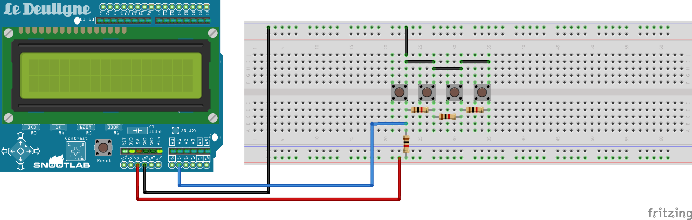
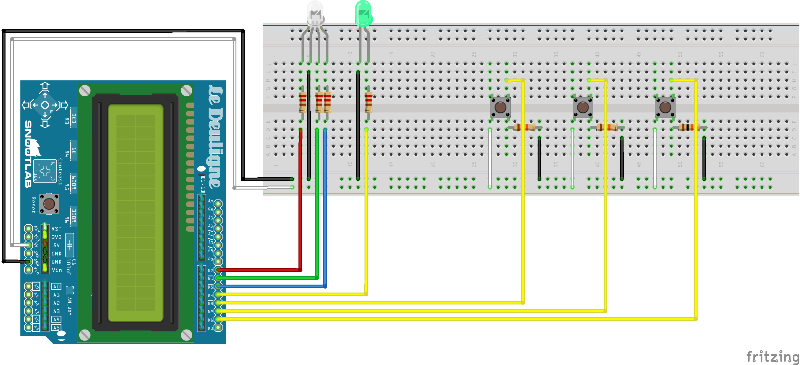

# Coffee Machine - Les 3 Mousquetaires

## Équipe
- Azémard Elisabeth (Athos)
- Ferraille Maxime (Porthos)
- Duval Pauline (Aramis)
- Schlosser Vincent (Dartagan)

## Environnement technique
Arduino. Choisi pour avoir un rendu physique et non pas seulement une interface web.
Lors de la réflexion et de la conception technique, nous avons décidé d'avoir une approche objet dans la réalisation de notre programme. 
Cependant, l'IDE Arduino compile les fichiers Arduino (\*.ino) par ordre alphabétique, ce qui rend difficile le nommage de nos fichiers. Il est impossible d'intégrer la notion d'héritage entre plusieurs fichiers Arduino. La meilleure solution est d'utiliser un seul programme Arduino que l'on nomme "header" de notre programme. Il sera donc compilé en premier dans le micro-controller et contiendra tous les appels aux librairies ainsi que les deux fonctions principales propres à Arduino : setup et loop. Toutes nos classes seront importées en tant que librairies (programme en C++, C, etc.) en début de fichier. 

## Répartition des tâches
- Maxime : montage de l'Arduino
- Pauline : Algorithme / Programmation
- Vincent : Algorithme / Programmation
- Elisabeth : Algorithme / Documentation

## Étapes
### A - Construction de l'algorithme
#### Paiement de la boisson
En premier lieu on paie sa boisson. Pour ajouter de l'argent dans la machine, on appuie sur un bouton : 1€, 50c ou 20c.

#### Choix du sucre
Tant qu'on n'a pas sélectionné de boisson, on peut appuyer sur "+" ou "-" pour choisir la quantité de sucre souhaitée. Le choix se fait entre 0 et 5 (au-delà, il affiche un message : "attention à vos artères !").

#### Sélection de la boisson
Une fois que l'on a inséré de l'argent et choisi sa dose de sucre, on sélectionne la boisson que l'on souhaite au moyen d'un bouton poussoir. Le nom de la boisson s'affiche sur l'écran LCD, ainsi que la somme restante à payer s'il manque de la monnaie.

#### Service de la boisson
Une fois que les conditions de paiement sont remplies (assez ou plus d'argent "inséré" que le prix indiqué), le gobelet tombe (message qui s'affiche sur l'écran LCD : "Voici un gobelet !". La LED RGB s'allume : elle indique le soluble choisi (café ou chocolat). Elle change ensuite de couleur pour indiquer le liquide versé : de l'eau (BLEU), du lait (BLANC) ou les deux (ROSE), pendant la durée nécessaire au versement de la boisson (celle-ci dépend de la boisson : café court ou long par exemple).

#### Rendu de la monnaie
Le calcul est fait pour savoir si la monnaie "insérée" au départ excède le prix de la boisson ou non, auquel cas la monnaie à rendre s'affiche sur l'écran LCD, en même temps que la boisson est distribuée (c'est à dire que les LED de l'Arduino sont allumées).

#### Touillette
À la fin de la distribution de la boisson, si la boisson est sucrée, une touillette tombe (un message s'affiche sur l'écran : "Voici une touillette !").

#### Récupération de la boisson
Une fois que le café est prêt, l'écran LCD affiche un message "Servez-vous !" et la LED verte s'allume.
-> Voir l'algorithme dans le wiki

### B - Montage de l'Arduino
#### Idée de départ
Faire un bouton analogique pour sélectionner les boissons afin d'avoir plus de place pour d'autres composants. Impossible à mettre en place en raison de limitations matérielles.

#### Idée retenue
Chaque boisson a son propre bouton, ce qui limite le nombre de LED qu'il est possible de brancher.

##### Matériel utilisé
###### LEDs
1 LED RGB pour indiquer :
- quel type de soluble est versé au moment du service de la boisson :
        - chocolat -> JAUNE
        - café -> VIOLET
- quel liquide est ensuite ajouté :
        - eau -> BLEU
        - lait -> BLANC
        - eau + lait -> ROSE

1 LED de couleur unie verte pour indiquer : que la boisson est prête

###### Écran LCD 
L'écran LCD permet l'affichage des informations au fur et à mesure de la commande :
- La quantité de monnaie insérée dans la machine
- La quantité de sucre sélectionnée le cas échéant
- Le nom & prix de la boisson après la sélection si le prix n'est pas atteint
- Le gobelet tombé après paiement : "Voici un gobelet !"
- La touillette donnée après la fin de la distribution : "Voici une touillette !" (signifie que la boisson est sucrée)
- café prêt : "Servez-vous !"

###### Boutons poussoirs
Chaque bouton est associé à un objet de la classe "Boissons" :
- Café court
- Café au lait
- Chocolat

###### Bouton analogique
Le bouton analogique dispose de cinq états différents qui permettent l'ajout de "pièces" différentes (1€, 50c, 20c, 5c)

### C - Reading the Manual - Formation express Arduino pour Pauline, Vincent et Elisabeth

### D - De l'algorithmie à la programmation
1. Création des classes (Pauline)
2. Traduction de l'algorithme en Arduino
